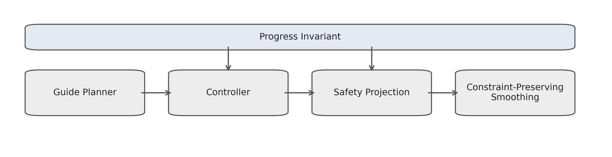

# deterministic-social-navigation

Deterministic navigation with execution-level progress invariants.

This repository contains a reproducible research codebase for deterministic social navigation with a global progress invariant enforced on the executed robot state after projection, smoothing, and runtime correction. The project includes the simulator, evaluation pipeline, logged results, publication figures, and the ICRA/IROS-style manuscript.

## Key idea

The core contribution is execution-level correctness rather than a new planner class. The system tracks guide progress on the final committed state of the robot, not on an intermediate command. This lets the controller:

- enforce safety at runtime through projection and rollback;
- preserve non-regressing progress after downstream corrections;
- evaluate every reported figure and table directly from recorded execution logs.

## Pipeline



The runtime stack is:

1. Guide planner proposes a route.
2. Controller produces a nominal motion command.
3. Safety projection and constraint-preserving smoothing shape the executed command.
4. A global progress frontier is enforced on the final realized state.

This alignment between theory and the executed state is the central research claim of the paper.

## Repository layout

```text
deterministic-social-navigation/
├── src/                     # simulator, controller, plotting
├── evaluation/              # reproducible evaluation pipeline
├── figures/                 # paper-ready figures generated from logs
├── paper/                   # LaTeX manuscript, class file, compiled PDF
├── results/paper_eval/      # logged runs, summaries, and generated LaTeX tables
├── logs/                    # notes about optional sample logs
├── requirements.txt
└── README.md
```

## Reproducibility

All quantitative results, tables, and data figures are generated directly from recorded execution logs. No synthetic trajectories or hand-authored progress traces are used in the paper assets.

## Installation

```bash
python -m venv .venv
source .venv/bin/activate
pip install -r requirements.txt
```

## How to run

Regenerate the evaluation suite, tables, and figures:

```bash
python evaluation/paper_validation.py
python src/trajectory_visualization.py
```

The first command runs the logged paper evaluation and regenerates:

- `results/paper_eval/combined_run_results.csv`
- `results/paper_eval/combined_summary_results.csv`
- `results/paper_eval/*.tex`
- `figures/*.png`

The second command regenerates the representative trajectory, progress, and pipeline figures from logged trials. If `results/paper_eval/` already exists, it selects a default representative logged run automatically.


## Main artifacts

- Source simulator: `src/phase3.py`
- Figure generation: `src/trajectory_visualization.py`
- Evaluation pipeline: `evaluation/paper_validation.py`
- Manuscript: `paper/paper_icra.tex`
- Logged paper results: `results/paper_eval/`

## License

This project is released under the MIT License. See `LICENSE`.
