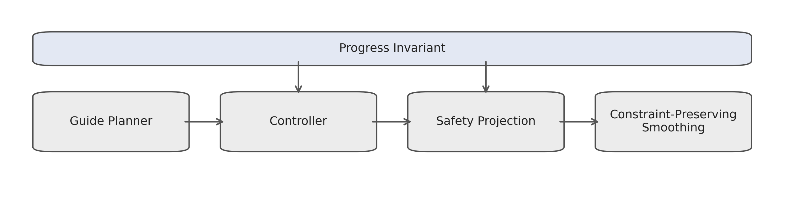

# deterministic-social-navigation

A deterministic, reproducible evaluation pipeline for social navigation, with an honestly-ablated progress-regression safeguard.

This repository contains a reproducible research codebase for social navigation built around a guide-planner-based controller with a runtime safety-projection layer and a bounded progress-regression safeguard. The project includes the simulator, evaluation pipeline, logged results, and publication figures.

## Key idea

The core, defensible contribution is a fully deterministic, seed-reproducible simulation and evaluation pipeline in which every reported table and figure is regenerated directly from logged execution traces, plus the guide-planner controller and its safety-projection layer. On top of that pipeline we also implement and evaluate an execution-level progress-regression safeguard that tracks guide progress on the robot's final committed state (not an intermediate command) and freezes or rolls back the executed step when that progress would regress.

We isolate the safeguard with a clean, single-variable ablation across five scenarios and 250 paired trials and report the result honestly: it changes zero success/failure outcomes at the seed level, and its effect on the regression-event and time-to-goal metrics it targets is scenario-dependent, including one scenario where it makes both worse. See `paper/paper_icra.tex` for the full analysis, including a confirmed trace-level diagnosis of that scenario. This is a negative/mixed ablation result reported as such, not a demonstrated performance benefit — the pipeline's determinism and reproducibility are what this repository actually delivers.

The controller:

- enforces safety at runtime through projection and rollback;
- tracks and, when enabled, enforces non-regressing guide progress after downstream corrections;
- evaluates every reported figure and table directly from recorded execution logs.

## Pipeline



The simulated execution stack is:

1. Guide planner proposes a route.
2. Controller produces a nominal motion command.
3. Safety projection and constraint-preserving smoothing shape the executed command.
4. A global progress frontier is optionally enforced on the final realized state (the progress-regression safeguard, ablated in the paper).

This is a 2D kinematic simulation, not a hardware control stack: there is no actuator, sensing-noise, or real-time control-loop model. All reported quantities are measured on the simulated realized state after this full step, not on an intermediate command.

## Repository layout

```text
deterministic-social-navigation/
├── src/                     # simulator, controller, plotting
├── evaluation/              # reproducible evaluation pipeline
├── figures/                 # paper-ready figures generated from logs
├── results/paper_eval/      # logged runs, summaries, and generated LaTeX tables
├── paper/                   # manuscript (paper_icra.tex), class file, references
├── logs/                    # notes about optional sample logs
├── requirements.txt
└── README.md
```

## Reproducibility

All quantitative results, tables, and data figures are generated directly from recorded execution logs. No synthetic trajectories or hand-authored progress traces are used in the paper assets.

## Installation

```bash
python -m venv .venv
source .venv/bin/activate
pip install -r requirements.txt
```

## How to run

Regenerate the evaluation suite, tables, and figures:

```bash
python evaluation/paper_validation.py
python src/trajectory_visualization.py
```

The first command runs the logged paper evaluation and regenerates:

- `results/paper_eval/combined_run_results.csv`
- `results/paper_eval/combined_summary_results.csv`
- `results/paper_eval/*.tex`
- `figures/*.png`

The second command regenerates the representative trajectory, progress, and pipeline figures from logged trials. If `results/paper_eval/` already exists, it selects a default representative logged run automatically.


## Main artifacts

- Source simulator: `src/phase3.py`
- Figure generation: `src/trajectory_visualization.py`
- Evaluation pipeline: `evaluation/paper_validation.py`
- Manuscript: `paper/paper_icra.tex`
- Logged paper results: `results/paper_eval/`

## License

This project is released under the MIT License. See `LICENSE`.
